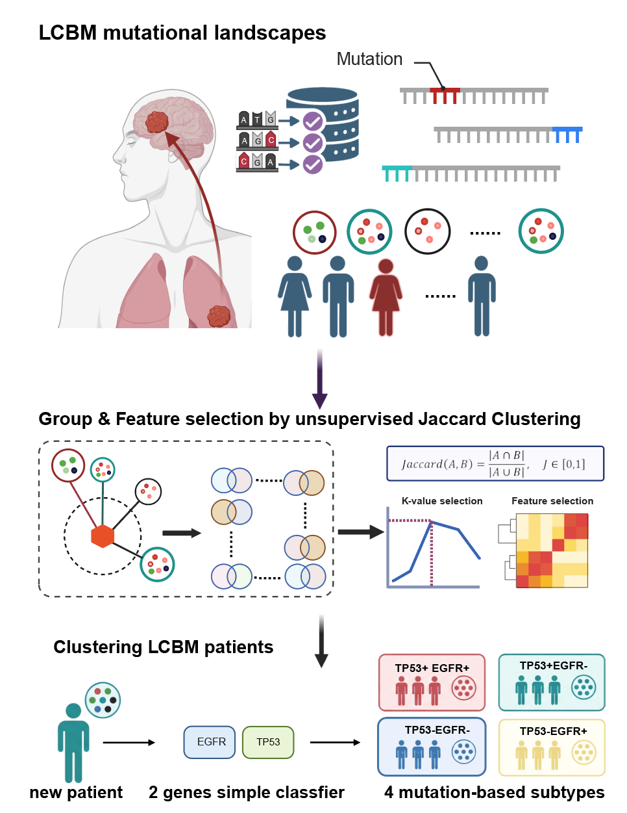
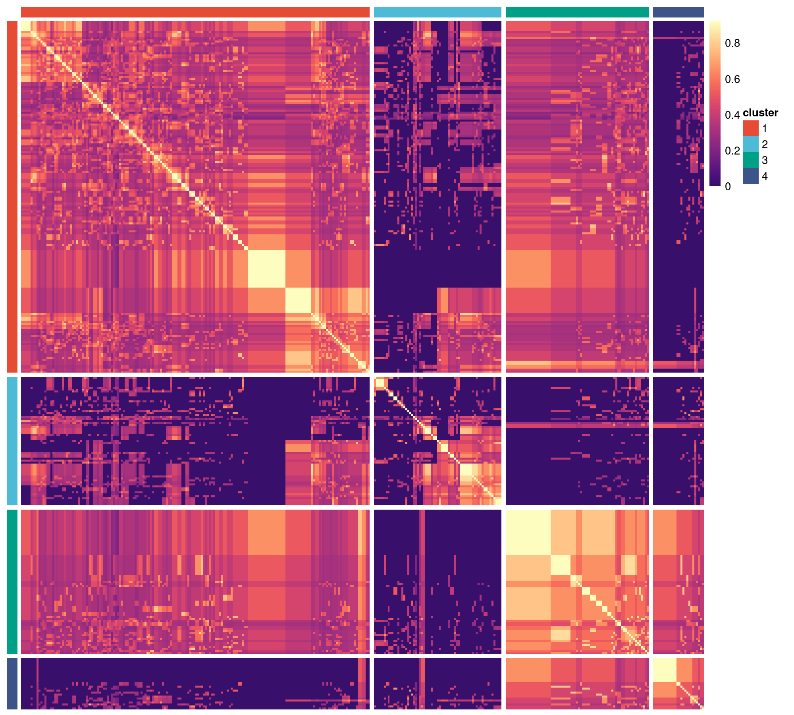
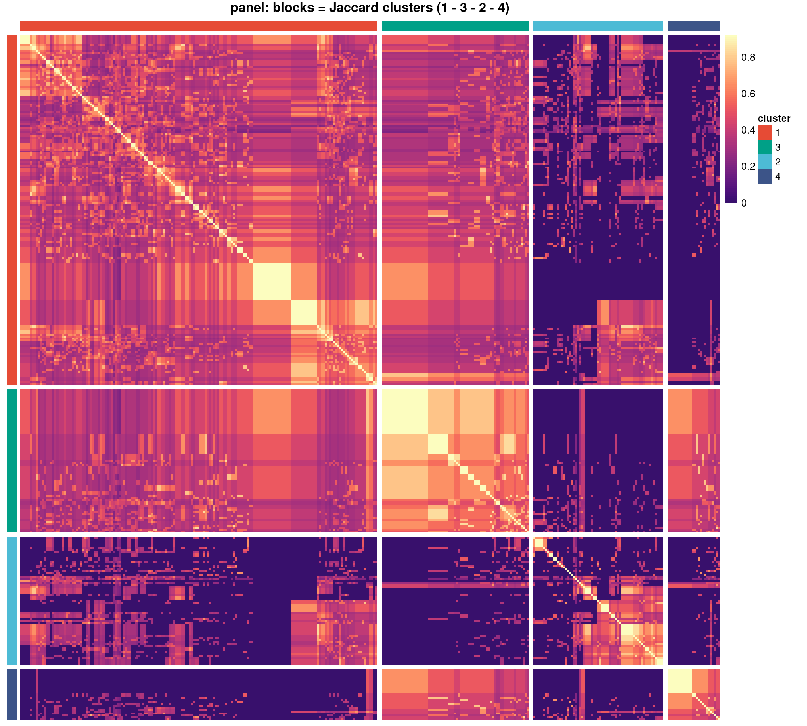
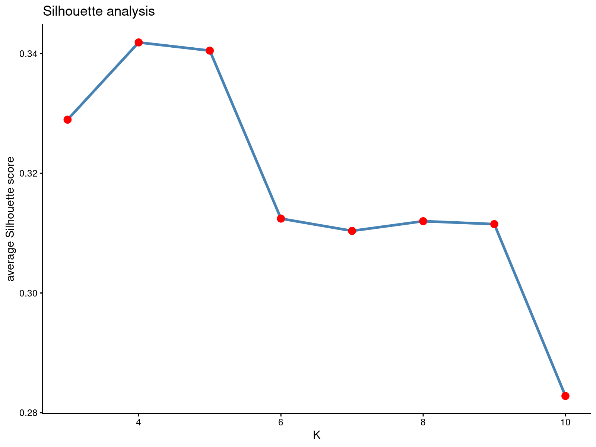
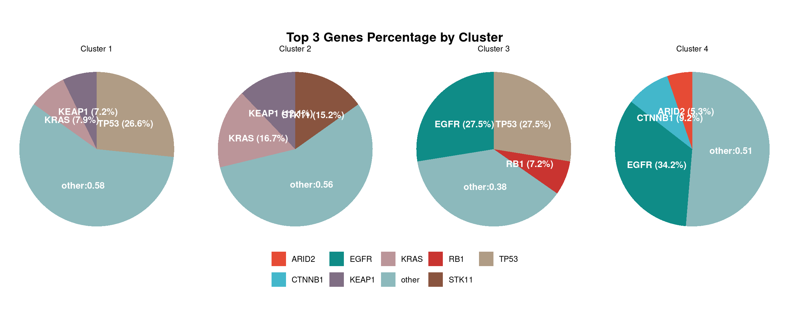
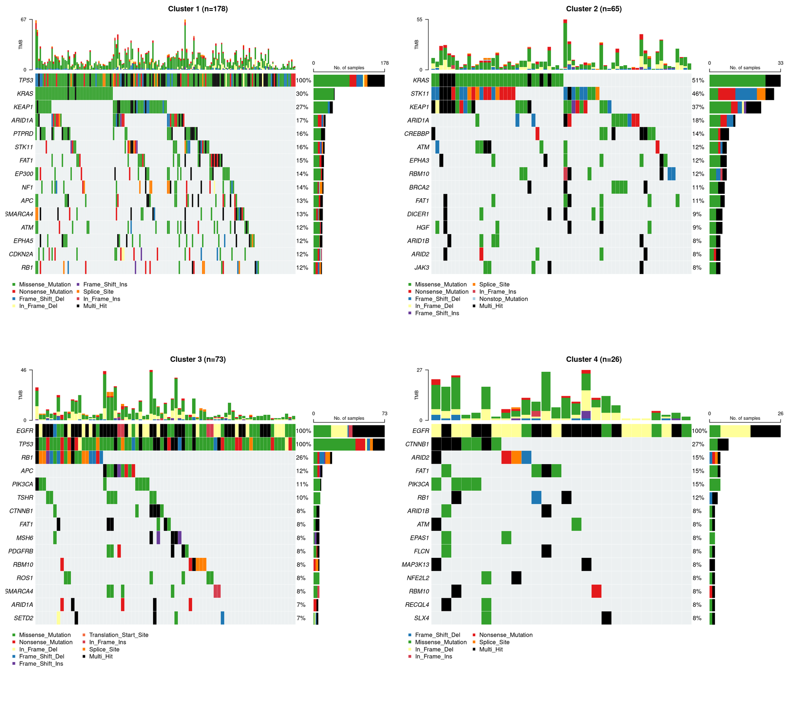
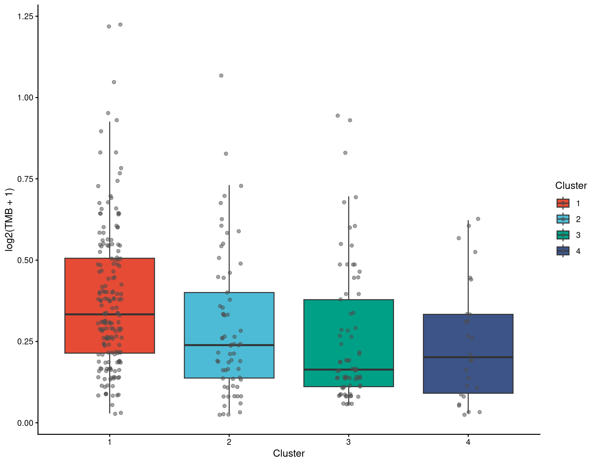

# OncoclassfieR

**A Jaccard similarity-based framework for mutation-based subgroup stratification
and feature-gene selection.**



## Introduction

`OncoclassfieR` is an R package for characterising somatic mutation profiles
through unsupervised clustering, evaluating cluster partitions and identifying
subgroup-associated genes. It quantifies pairwise similarity using the Jaccard
similarity coefficient (J): the number of mutated features shared by two samples
divided by the total number of distinct mutated features observed in either
sample.

```
J(A, B) = |A ∩ B| / |A ∪ B|,    J ∈ [0, 1]
```

Here, A and B are the sets of mutated features in two samples. For the
gene-level workflow below, each feature represents a gene.

Starting from a binary mutation matrix, `OncoclassfieR` calculates pairwise
Jaccard similarities to construct an n × n symmetric similarity matrix. It then
performs hierarchical clustering using Euclidean distances between samples'
similarity profiles. The default linkage method is `complete`, and a
reproduction example below uses `ward.D2`. Clustering in this
similarity-profile space can yield clearer cluster boundaries and higher
silhouette widths than clustering directly on the complementary Jaccard
distance, `1 - J`.

The package uses silhouette analysis to compare partition quality across a
range of cluster counts (`k`) and summarises the most frequently mutated genes
within each subgroup to support biological interpretation.

In a typical analysis, `OncoclassfieR` is applied to a mutation dataset: the
number of clusters is evaluated, subgroup-associated feature genes are
identified, and the concordance between the `OncoclassfieR`-derived clusters
and an independent rule-based classification can be assessed.

The schematic above summarises the overall workflow: mutation data are
converted into per-sample profiles (top), Jaccard similarity supports subgroup
discovery and subsequent feature-gene selection (middle), and the selected
genes inform a four-subtype classification scheme for new patients (bottom).
The examples below focus on reproducing the cohort-level clustering and
subgroup characterisation.

| Step | Function |
| --- | --- |
| Harmonise cohorts from different platforms | `maf_common_columns()`, `shape_maf()` |
| Retain the most frequently mutated genes | `preprocess_maf_top_genes()` |
| Calculate pairwise similarity | `jaccard_similarity_matrix()` |
| Cluster samples and evaluate `k` | `jaccard_cluster()`, `silhouette_analysis()` |
| Plot a heatmap in a specified subgroup order | `plot_jaccard_heatmap()` |
| Summarise subgroup mutation profiles | `cluster_top_genes()`, `plot_cluster_piechart()` |
| Visualise subgroup oncoplots and TMB | `plot_cluster_oncoplot()`, `plot_tmb_by_cluster()` |
| Analyse survival | `fit_km()`, `fit_cox()`, `plot_km_curves()` |

Clustering is unsupervised: subgroup numbers are algorithmic identifiers, not
biological labels, and should not be assumed to correspond across cohorts.
Interpret each subgroup in the context of its frequently mutated genes and
mutation spectrum. The package includes the panel cohort (358 samples) and a
clinical annotation table (520 samples). These datasets are used by
`LCBM_reproduction.R` below.

## Installation

Install `OncoclassfieR` from GitHub using `devtools`:

```r
install.packages("devtools")   # once
devtools::install_github("LUCAXXSS/OncoclassfieR")
```

Alternatively, install from a local source directory:

```r
# from a local checkout (the directory holding DESCRIPTION)
devtools::install("path/to/OncoclassfieR")

# or, in the same directory, simply
devtools::install()
```

While developing, load the package without installing it:

```r
devtools::load_all("path/to/OncoclassfieR")
```

`maftools` is a required dependency distributed through Bioconductor. If it is
not already available, install it before installing `OncoclassfieR`:

```r
if (!requireNamespace("BiocManager", quietly = TRUE)) install.packages("BiocManager")
BiocManager::install("maftools")
```

The package requires R ≥ 4.1 and contains no compiled code. Required
dependencies are listed in `DESCRIPTION`; suggested packages support testing,
vignettes and figure regeneration.

## Example analysis workflow

The following example demonstrates a typical `OncoclassfieR` workflow using
the included LCBM panel dataset, from data preparation and clustering to
subgroup characterisation and visualisation. Each figure is accompanied by
the code used to generate it. In the examples, `grp` denotes the cohort, `maf`
its MAF object, `res` its clustering result and `out_dir` the output directory.

### Data

```r
library(OncoclassfieR)

# The real cohorts and the clinical annotation table ship with the package.
# The `::` form works both after install and under devtools::load_all().
maf               <- OncoclassfieR::LCBM_panel_maf
sample_annotation <- OncoclassfieR::LCBM_sample_annotation

# To run the same workflow on the WES cohort instead:
# maf <- OncoclassfieR::LCBM_WES_maf
```

Every chunk below is written for a single-cohort run: `grp` names the cohort,
`maf` is its MAF object and `out_dir` is where figures and tables are written.
For the panel cohort:

```r
grp     <- "panel"
out_dir <- "LCBM_panel_figures"
dir.create(out_dir, showWarnings = FALSE)
```

### Clustering parameters

```r
max_features      <- 20
n_clusters        <- 4
clustering_method <- "ward.D2"
enhancement       <- 0.6
seed              <- 1234
top_genes_pie     <- 3
top_genes_table   <- 20
top_genes_oncoplot <- 15
```

### Clustering

```r
set.seed(seed)
maf_top <- preprocess_maf_top_genes(maf, max_features = max_features,
                                    drop_empty_samples = TRUE)

res <- jaccard_cluster(maf_top, n_clusters = n_clusters,
                       clustering_method = clustering_method,
                       enhancement = enhancement,
                       show_colnames = FALSE, plot = FALSE)

clusters <- res$sample_clusters
clusters <- clusters[order(clusters$cluster, clusters$Tumor_Sample_Barcode), ]
```

### Similarity heatmap

```r
hm <- plot_jaccard_heatmap(res, group_order = as.character(seq_len(n_clusters)),
                           clustering_method = clustering_method,
                           show_colnames = FALSE, plot = FALSE)
png(file.path(out_dir, paste0("LCBM_jaccard_heatmap_", grp, ".png")),
    width = 2000, height = 1800, res = 200)
print(hm$heatmap)
dev.off()
```



Pairwise Jaccard similarity heatmap for the panel cohort, arranged by subgroup.

### Adjusting subgroup display order in the heatmap

Use `group_order` in `plot_jaccard_heatmap()` to customise the order of subgroup
blocks along both heatmap axes. This changes the display order only: it does
not alter the clustering result, subgroup identifiers or sample assignments.
Specify `group_colors` as a named vector keyed by subgroup identifier to keep
each subgroup's colour consistent when the blocks are reordered.

The example below reproduces the panel-cohort heatmap from our manuscript
submitted to *Biomarker Research*. It displays the subgroups in order
**1–3–2–4**, rather than the default 1–2–3–4, with corresponding block sizes
of 178 / 73 / 65 / 26 samples.

```r
panel_order <- c(1, 3, 2, 4)
panel_cols  <- c("1" = "#E64B35", "2" = "#4DBBD5",
                 "3" = "#00A087", "4" = "#3C5488")

set.seed(seed)
maf_top <- preprocess_maf_top_genes(maf, max_features = max_features,
                                    drop_empty_samples = TRUE)
res <- jaccard_cluster(maf_top, n_clusters = n_clusters,
                       clustering_method = clustering_method,
                       enhancement = enhancement,
                       show_colnames = FALSE, plot = FALSE)

hm_paper <- plot_jaccard_heatmap(res,
                                 group_order        = panel_order,
                                 group_colors       = panel_cols,
                                 order_within_group = "hclust",
                                 clustering_method  = clustering_method,
                                 show_colnames      = FALSE,
                                 show_rownames      = FALSE,
                                 plot               = FALSE,
                                 main               = "panel: blocks = Jaccard clusters (1 - 3 - 2 - 4)",
                                 fontsize           = 9)

png("LCBM_panel_jaccard_heatmap_paper_order.png",
    width = 2000, height = 1800, res = 200)
print(hm_paper$heatmap)
dev.off()

hm_paper$group        # the subgroup of every sample, sorted like the figure
hm_paper$group_order  # c(1, 3, 2, 4)
```



Panel-cohort heatmap reproduced in the layout used in our *Biomarker Research*
submission: 342 samples, with subgroup blocks displayed in order 1–3–2–4.
The reordered blocks retain their original subgroup identifiers and sample
assignments.
`hm_paper$group` records each sample's subgroup in the displayed order and can
be used to align downstream subgroup summaries with the figure.

### Silhouette curve

```r
sil <- silhouette_analysis(res, k_range = 3:10,
                           clustering_method = clustering_method)
png(file.path(out_dir, paste0("LCBM_silhouette_", grp, ".png")),
    width = 1600, height = 1200, res = 200)
print(sil$plot)
dev.off()
```



Average silhouette width across `k = 3 … 10`, used to evaluate the choice of
`n_clusters`. The reproduction uses four subgroups for the panel cohort.

### Top genes per subgroup

```r
top_tab <- cluster_top_genes(maf, res, top = top_genes_table)
pie <- plot_cluster_piechart(top_tab, top = top_genes_pie)
pdf(file.path(out_dir, paste0("LCBM_cluster_piechart_", grp, ".pdf")),
    width = 8, height = 6)
print(pie)
dev.off()
```



The three most frequently mutated genes in each subgroup, with mutations in
the remaining genes pooled into `"other"`.

### Oncoplots per subgroup

```r
pdf(file.path(out_dir, paste0("LCBM_oncoplot_", grp, ".pdf")),
    width = 10, height = 8)
for (cl in sort(unique(clusters$cluster))) {
  plot_cluster_oncoplot(maf, clusters, cluster_id = cl,
                        top = top_genes_oncoplot)
}
dev.off()
```



Oncoplots showing the top 15 mutated genes in each subgroup. The script saves
a multipage PDF; the image above presents the four subgroups as a 2 × 2
montage.

### TMB per subgroup

```r
tmb_res <- plot_tmb_by_cluster(maf, clusters)
png(file.path(out_dir, paste0("LCBM_tmb_", grp, ".png")),
    width = 1800, height = 1400, res = 200)
print(tmb_res$plot)
dev.off()
```



Subgroup TMB distributions on the `log2(TMB + 1)` scale, with pairwise
comparisons assessed using Wilcoxon tests.

## Reproducing the manuscript analysis

To reproduce the LCBM clustering and subgroup analyses presented in our
manuscript submitted to *Biomarker Research*, run
`inst/examples/LCBM_reproduction.R` using the datasets included in the package:

```bash
Rscript inst/examples/LCBM_reproduction.R /path/to/output
```

The script generates similarity heatmaps, silhouette curves, subgroup pie
charts and oncoplots, and tumour mutational burden (TMB) comparisons for each
cohort included in the package. It then checks the output tables against the
reference results in `inst/extdata/LCBM_expected/`. The first argument specifies the output
directory; if omitted, the script uses a temporary directory.

After retaining the top 20 mutated genes and excluding samples with no
mutations in those genes, the panel cohort analysis includes 342 samples in four
subgroups (178 / 65 / 73 / 26), with sample counts listed in subgroup order
1–4.
